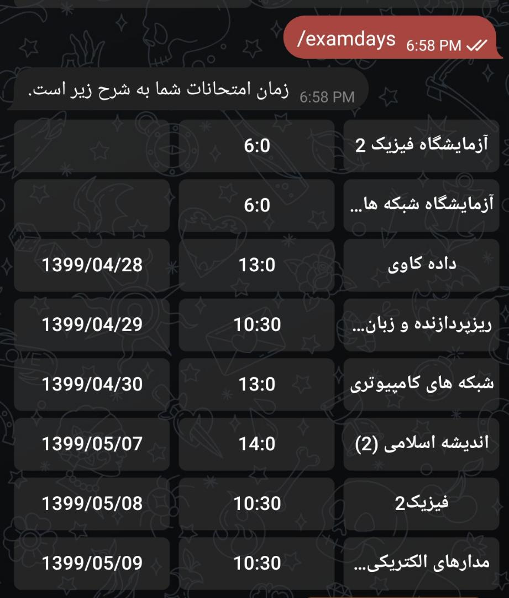
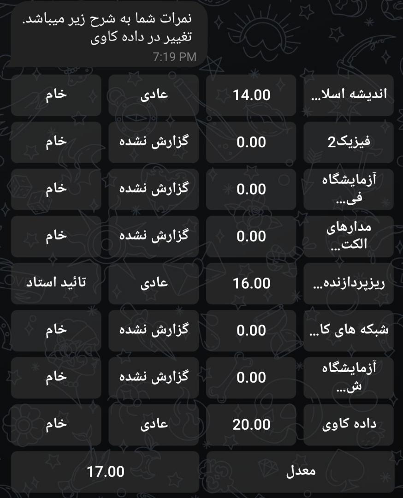

Khayyam grade reporter
===

A **telegram** bot to report new grades of pooya.khayyam.ac.ir .

## Features
---
1. Send you your grades, when you have a new grade.
2. You can see your grades.
3. Also you can see your exam days.


## Get start
---
1. Clone the project on your server / PC.
    > git clone https://github.com/apep-1998/khayyamgradereport.git

    >cd khayyamgradereport
2. Install project requirements
    > pip install -r requirements.txt
3. Create new telegram bot with [Botfather](https://t.me/botfather)
4. Add this commands to your bot.
    ```
    info - چطور با ربات کار کنم؟
    nowgrade - مشاهده نمرات فعلی شما
    examdays - مشاهده روز او ساعت امتحانات شما
    aboutme - اطلاعات بیشتر درباره ربات و نویسنده ربات
    ```
5. set bot token and admin password in Variables.py
6. Run programm
    >python main.py

7. send start message to your bot.

## Pictures
---
<div>


</div>
